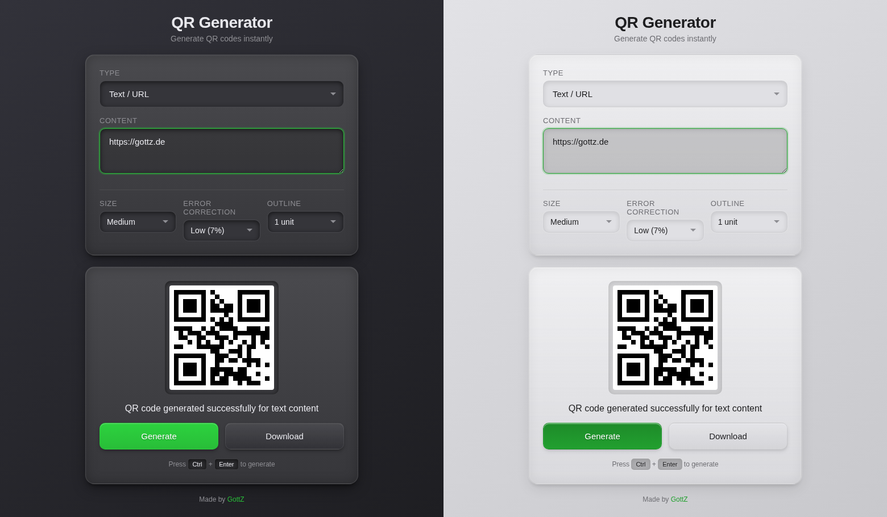

# QR Generator

A client-side QR code generator. No backend, no tracking, no nonsense. Everything happens in your browser.

**[gottz.de/qr](https://gottz.de/qr)**



## What it does

Generates QR codes for ten data types:

- **Text / URL** — plain text or links
- **WiFi** — SSID, password, security type, hidden flag
- **Email** — recipient, subject, body (mailto)
- **Phone** — dial link (tel)
- **SMS** — number + pre-filled message
- **vCard** — name, phone, email, org, title, URL
- **Location** — latitude/longitude (geo)
- **Bitcoin** — BIP21 payment URI with address, amount, label, message
- **SEPA Payment** — GiroCode (EPC v002), EPC v001 (legacy), BezahlCode (legacy). IBAN/amount validation, live byte counter, structured/unstructured reference toggle
- **Calendar Event** — iCal/VEVENT with title, start/end, location, description

Output is configurable: cell size (1x-16x), error correction (L/M/Q/H), and margin (0-4 units).

## PWA

Installable as a standalone app. Works offline after first visit.

**Share Target**: Share text, URLs, or `.vcf` files from other apps directly into the generator. Content type is auto-detected and the correct form is pre-filled.

**Update mechanism**: Stale-while-revalidate caching. The service worker serves cached files instantly, then fetches fresh versions in the background. If any file changed, a toast notification prompts the user to reload. No version bumping or build step required.

## URL API

Generate QR codes via GET parameters — no UI interaction needed. Append parameters to `https://gottz.de/qr/`.

### Global Parameters

| Parameter | Values | Default |
|-----------|--------|---------|
| `type` | `text`, `wifi`, `email`, `phone`, `sms`, `vcard`, `geo`, `bitcoin`, `sepa`, `event` | *(required)* |
| `size` | `1`, `4`, `8`, `12`, `16` | `8` |
| `error` | `L`, `M`, `Q`, `H` | `L` |
| `outline` | `0`, `1`, `2`, `4` | `1` |
| `plain` | *(flag, presence is enough)* | off |

### Type-specific Parameters

| Type | Parameters |
|------|-----------|
| `text` | `content` |
| `wifi` | `ssid`, `password`, `security` (WPA/WEP/nopass), `hidden` (true/false) |
| `email` | `to`, `subject`, `body` |
| `phone` | `number` |
| `sms` | `number`, `message` |
| `vcard` | `firstname`, `lastname`, `phone`, `email`, `org`, `title`, `url` |
| `geo` | `lat`, `lon` |
| `bitcoin` | `address`, `amount`, `label`, `message` |
| `sepa` | `name`, `iban`, `amount`, `bic`, `reference`, `format` (epc002/epc001/bezahlcode), `reftype` (unstructured/structured) |
| `event` | `title`, `start`, `end`, `location`, `description` |

`start`/`end` use `datetime-local` format: `YYYY-MM-DDTHH:mm`.

### Plain Mode

Add `&plain` to get a fullscreen QR code with no UI — useful for embedding or kiosk displays.

### Examples

```
# Simple text
https://gottz.de/qr/?type=text&content=Hello+World

# WiFi with all options
https://gottz.de/qr/?type=wifi&ssid=MyNetwork&password=secret&security=WPA

# SEPA GiroCode (EPC v002), plain display
https://gottz.de/qr/?type=sepa&name=Max+Mustermann&iban=DE89370400440532013000&amount=42.00&reference=Invoice+2025-001&plain

# SEPA with structured reference and BezahlCode format
https://gottz.de/qr/?type=sepa&name=Max+Mustermann&iban=DE89370400440532013000&amount=42.00&format=bezahlcode

# Calendar event
https://gottz.de/qr/?type=event&title=Meeting&start=2025-03-15T14:00&end=2025-03-15T15:00&location=Room+42
```

## Privacy

100% client-side. No server requests for QR generation, no analytics, no cookies. The QR library runs locally — your data never leaves the device.

## Stack

Zero build tools. Four source files, two libraries, one HTML entry point.

```
index.html          Entry point
script.js           App logic, custom dropdown, share target handling
style.css           Neumorphic theming, dark/light mode, responsive
sw.js               Service worker (stale-while-revalidate + update toast)
manifest.json       PWA manifest with share_target
ce.js               DOM creation helper (by GottZ)
qrcode.js           QR generation library (by Kazuhiko Arase)
icons/              PWA icons (192/512, standard + maskable)
```

Serve with any static file server. No transpilation, no bundling.

## Accessibility

- Custom dropdown with full ARIA combobox pattern
- Keyboard navigation (arrows, Enter, Escape, Home/End)
- Screen reader live region for generation status
- Focus indicators, reduced-motion support
- WCAG 2.1 compliant

## Credits

**QR Generator** by [GottZ](https://contact.gottz.de) — MIT License

Built with [Claude Code](https://claude.ai/claude-code). Libraries: [qrcode.js](http://www.d-project.com/) by Kazuhiko Arase (MIT), ce.js by GottZ (MIT).
